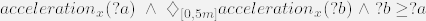

# TemporalStore Documentation
## Overview

The TemporalStore is a specialized container extending a Linked Data Platform (LDP) that processes GET requests with query parameters to filter and accumulate sensor data. Additionally, it supports temporal logic evaluation (true/false)based on the incoming query parameters.

It is built on top of containers used in Solid, meaning that it handles data processing for GET requests and augments it with specific temporal filtering and logic capabilities when query parameters are present.
## Features

* Accumulation of Sensor Data: The TemporalStore filters sensor observations based on specified query parameters like observed properties and timestamps.
* Temporal Query Support: Handles temporal logic operators such as diamond (◇) and box (□) to verify if specific conditions are met for the sensor data.
* Flexible Query Parameters: Enables complex filtering based on observed properties, sensor types, result values, and time intervals.

## Internal logic
* Container Check: Checks if the resource requested is a temporal container. If so, it retrieves and processes the contained sensor data.

* Filters Applied:         

    * Observed Property: Filters observations by their observed property.
    * Made by Sensor: Filters by the sensor that made the observation.
    * Timestamps: Filters based on time intervals provided (start and end times in various formats, both relative and absolute).    
    * Result Value: Filters observations by the result values with comparison operators such as gt_, gte_, lt_, lte_.

* Temporal Operators:
    * Supports two temporal operators together with a given time interval:
        * Diamond (◇): Checks if there exists at least one result that satisfies the conditions.
        * Box (□): Checks if all results satisfy the given conditions.

* Response:
        The data is returned either as JSON (for the operators diamond or box) or CSV (for direct observation data). When no parameters are present, the response is equal to the expected CSS behavior.

## Query Parameters
### Supported Parameters

* observedProperty:
        Filters observations by the specified observed property

	Example: ?observedProperty=http://example.org/property/temperature2

* madeBySensor:
        Filters by the sensor that recorded the observation.

   Example: ?madeBySensor=http://example.org/sensor/temperatureSensor

* intervalStart/intervalEnd:
        Relative interval filters. The value is specified in ISO8601 duration format.

    Example: ?intervalStart=P1D (1 day ago), ?intervalEnd=P1H (1 hour ago).

* intervalAbsoluteStart/intervalAbsoluteEnd:
        Absolute timestamps in ISO format.

     Example: ?intervalAbsoluteStart=2024-09-24T00:00:00Z.

* value:
        Filters the results based on the numerical value of the observation. Can use comparison operators:
            gt_ (greater than), gte_ (greater than or equal), lt_ (less than), lte_ (less than or equal).

    Example: ?value=gt_25

* operator:
        Temporal logic operators:
    * diamond (◇): Returns true if at least one observation satisfies the filter.
    * box (□): Returns true if all observations satisfy the filter.

    Example: ?operator=box

## Usage Example
### Example 1: Filtering Observations by Property and Time


```http
GET /temporalContainer?observedProperty=http://example.org/property/temperature&intervalStart=P1D&value=gt_20
```
Retrieves temperature observations from the past day where the temperature is greater than 20.

### Example 2: Temporal Logic with Diamond Operator

```http
GET /temporalContainer?observedProperty=http://example.org/property/temperature&operator=diamond&value=gt_20
```
Checks if at least one temperature observation is greater than 20.

### Example 3: Filtering by Sensor and Absolute Time Range

```http
GET /temporalContainer?madeBySensor=http://example.org/sensor/temperatureSensor&intervalAbsoluteStart=2024-09-24T00:00:00Z&intervalAbsoluteEnd=2024-09-25T00:00:00Z
```
Retrieves temperature data recorded by the specified sensor between two absolute timestamps.

### Example 4: Combination of multiple requests to evaluate acceleration changes

I want to find out: Does my acceleration decrease?

Or, more technical: Was `acceleration_x` at any time in the last five minutes higher than it currently (20.04.24 01:28) is?

Or, in Temporal Logic:



The TL formula can be translated into the following requests (we use absolute intervals instead of relative ones here for demonstration purposes):
```
http://localhost:3000/?intervalAbsoluteStart=2024-09-20T01:30:00&intervalAbsoluteEnd=2024-09-20T01:28:00&observedProperty=https%3A%2F%2Fsolid.iis.fraunhofer.de%2Fmsds%2Fproperties%23acceleration-x
```
Use the result as value for the following request:
```
http://localhost:3000/?intervalAbsoluteStart=2024-09-20T01:28:00&intervalAbsoluteEnd=2024-09-20T01:23:00&observedProperty=https%3A%2F%2Fsolid.iis.fraunhofer.de%2Fmsds%2Fproperties%23acceleration-x&value=gte_68&operator=diamond
```
This leads to `true` which means our acceleration is decreasing. If you want to see the values that are responsible for this result, you can just drop the diamond operator:
```
http://localhost:3000/?intervalAbsoluteStart=2024-09-20T01:28:00&intervalAbsoluteEnd=2024-09-20T01:23:00&observedProperty=https%3A%2F%2Fsolid.iis.fraunhofer.de%2Fmsds%2Fproperties%23acceleration-x
```


## Configuration
### Confifuration of CSS
We use "css:config/storage/middleware/temporal.json" as configuration file and inserted the TemporalStore directly between the ResourceStore and the ResourceStore_BinarySlice as: 

```ts
{
      "comment": "Sets up a stack of utility stores used by most instances.",
      "@id": "urn:solid-server:default:ResourceStore_Temporal",
      "@type": "TemporalStore",
      "source": { "@id": "urn:solid-server:default:ResourceStore_BinarySlice" }
    },
```

To use our configuration, we replaced the normally used ""css:config/storage/middleware/default.json" with "css:config/storage/middleware/temporal.json" in "/config/file-root.json".

### Patch container
To recognize a TemporalStore, LDP containers have to have the RDF type `https://solid.ti.rw.fau.de/public/ns/tc#TemporalContainer`. We prepared the script `patch-temporal-container.sh` you may use to patch an existing container easily. 

The script uses the ttl in `patch-temporal-container.ttl` to patch the CSS the Solid way.

Adapt both for your needs.

### Run server
Run the CSS as usual with
```
npm run start
```
After you patched your container to be a TemproalContainer, insert all measurements as RDF resources (ldp:contains). Afterwards, you may send GET requests with query parameters as shown above.

## Last words
Our work part of the MSDS Mini working group.

2024-09-25

Yours truly,
dschraudner
se-schmid
